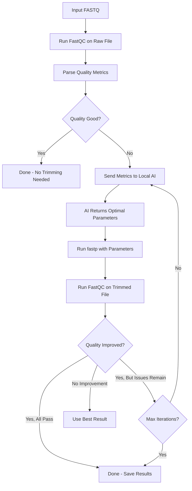

# trimora

**AI-Powered FASTQ Quality Control and Trimming Tool**

[](https://www.python.org/downloads/)
[](LICENSE)

Author: **Govind Mangropa** | Molynex Lab

---

## 🌟 Overview

**trimora** is a fully automated, AI-powered command-line tool for intelligent quality control and trimming of FASTQ sequencing files. It combines FastQC for quality analysis, fastp for trimming, and a local AI model (via Ollama) to make intelligent parameter decisions—all running completely offline with no cloud dependencies.

### Key Features

- ✨ **Fully Automated**: One command processes your FASTQ files end-to-end
- 🤖 **AI-Driven**: Local LLM (llama3:8b) intelligently selects optimal trimming parameters
- 🔄 **Iterative Optimization**: Automatically refines parameters until quality targets are met
- 🔒 **100% Offline**: No cloud APIs, no external dependencies, complete privacy
- 📊 **Comprehensive Reports**: FastQC reports before/after, parameter history, quality metrics
- ⚡ **Cross-Platform**: Works on Linux, macOS, and Windows
- 🎯 **Conservative**: Minimizes data loss while maximizing quality improvement

---

## 🚀 Quick Start

### Installation

```bash
pip install trimora
```

### Basic Usage

```bash
# Process a single FASTQ file
trimora sample.fastq

# Process multiple files
trimora sample_R1.fastq sample_R2.fastq

# Use wildcards
trimora *.fastq

# Specify output directory and threads
trimora sample.fastq -o my_output --threads 8

# Full control with all options
trimora input/*.fastq -o results/ --threads 16 --max-iterations 5 --model llama3:8b
```

That's it! trimora handles everything automatically.

---

## 📋 Prerequisites

Before using trimora, ensure you have the following tools installed:

### 1. FastQC

**Ubuntu/Debian:**

```bash
sudo apt-get install fastqc
```

**macOS:**

```bash
brew install fastqc
```

**Manual:** [https://www.bioinformatics.babraham.ac.uk/projects/fastqc/](https://www.bioinformatics.babraham.ac.uk/projects/fastqc/)

### 2. fastp

**Ubuntu/Debian:**

```bash
sudo apt-get install fastp
```

**macOS:**

```bash
brew install fastp
```

**Manual:** [https://github.com/OpenGene/fastp](https://github.com/OpenGene/fastp)

### 3. Ollama (for local AI)

**Linux:**

```bash
curl -fsSL https://ollama.com/install.sh | sh
```

**macOS:**

```bash
brew install ollama
```

**Manual:** [https://ollama.com/download](https://ollama.com/download)

**Start Ollama service:**

```bash
ollama serve
```

The `llama3:8b` model will be automatically downloaded on first use if not present.

---

## 🔧 How It Works

trimora follows an intelligent, iterative pipeline:



### Pipeline Steps

1. **Initial Quality Check**: Run FastQC on the raw FASTQ file
2. **AI Analysis**: Parse metrics and send to local LLM
3. **Parameter Generation**: AI returns optimal fastp parameters in JSON format
4. **Trimming**: Execute fastp with AI-generated parameters
5. **Verification**: Run FastQC on trimmed file
6. **Iteration**: If quality issues persist, refine parameters (max 3 iterations)
7. **Output**: Save best result with comprehensive reports

---

## 📊 Output Files

For each input file, trimora creates:

```
trimora_output/
├── sample/
│   ├── sample_trimmed.fastq           # Final trimmed FASTQ
│   ├── raw_fastqc/                    # FastQC report (raw)
│   │   ├── fastqc_data.txt
│   │   └── fastqc_report.html
│   ├── trimmed_fastqc/                # FastQC report (trimmed)
│   │   ├── fastqc_data.txt
│   │   └── fastqc_report.html
│   ├── fastp_reports/                 # fastp reports
│   │   ├── sample_trimmed_fastp.json
│   │   └── sample_trimmed_fastp.html
│   └── summary.json                   # Complete parameter history
└── trimora_summary.json               # Overall batch summary
```

---

## 🎛️ Advanced Usage

### Control Thread/Core Usage

Speed up processing by using more CPU cores:

```bash
# Use 8 threads (default is 4)
trimora sample.fastq --threads 8

# Maximum performance with 16 threads
trimora *.fastq -t 16 -o results/
```

### Custom Input/Output Directories

```bash
# Process files from one directory, output to another
trimora /path/to/input/*.fastq -o /path/to/output/

# Relative paths work too
trimora ../data/*.fastq -o ./processed/
```

### Keep Intermediate Files

By default, trimora cleans up intermediate iteration files. To keep them:

```bash
trimora sample.fastq --keep-intermediate
```

### Custom Iterations

```bash
trimora sample.fastq --max-iterations 5
```

### Custom AI Model

```bash
trimora sample.fastq --model llama3.1:70b
```

### Custom Prompt Template

Create a custom prompt file:

```bash
trimora sample.fastq --prompt my_prompt.txt
```

### Help

```bash
trimora --help
```

---

## 🧬 AI Decision Making

The AI acts as a **decision engine**, not a chatbot. It receives structured FastQC metrics and returns **only JSON parameters**:

### Example Input to AI:

```json
{
  "module_status": {
    "Per base sequence quality": "WARN",
    "Adapter Content": "FAIL"
  },
  "quality_summary": {
    "average_quality": 28.5,
    "min_quality": 22.1
  },
  "adapter_contamination": 12.5
}
```

### Example AI Output:

```json
{
  "quality": 22,
  "length": 40,
  "trim_front": 0,
  "trim_tail": 10,
  "adapter_trim": true,
  "poly_g_trim": false
}
```

No explanations, no text—just actionable parameters.

---

## ⚙️ Parameter Ranges

The AI can specify:

| Parameter      | Type | Range      | Description                          |
| -------------- | ---- | ---------- | ------------------------------------ |
| `quality`      | int  | 0-40       | Minimum Phred quality score          |
| `length`       | int  | 1-300      | Minimum read length after trimming   |
| `trim_front`   | int  | 0-50       | Bases to trim from 5' end            |
| `trim_tail`    | int  | 0-50       | Bases to trim from 3' end            |
| `adapter_trim` | bool | true/false | Enable adapter detection             |
| `poly_g_trim`  | bool | true/false | Enable polyG tail trimming (NextSeq) |

All parameters are validated and sanitized before execution.

---

## 🐛 Troubleshooting

### "Ollama is not running"

Start the Ollama service:

```bash
ollama serve
```

### "Model llama3:8b not found"

The model should auto-download, but you can manually install:

```bash
ollama pull llama3:8b
```

### "FastQC/fastp not found"

Ensure the tools are in your system PATH:

```bash
which fastqc
which fastp
```

### "Invalid FASTQ format"

Ensure your file follows standard FASTQ format (4-line records starting with `@`).

---

## 📖 Citation

If you use trimora in your research, please cite:

```
Mangropa, G. (2026). trimora: AI-Powered FASTQ Quality Control and Trimming.
Molynex Lab. https://github.com/govindab34/trimora
```

---

## 📜 License

MIT License - see LICENSE file for details

---

## 👨‍💻 Author

**Govind Mangropa**  
Molynex Lab  
[GitHub](https://github.com/govindab34) | [Email](mailto:govind@molynexlab.org)

---

## 🙏 Acknowledgments

- **FastQC** by Babraham Bioinformatics
- **fastp** by Shifu Chen
- **Ollama** by Ollama Team
- **llama3** by Meta AI

---

## 📝 Version History

### v1.0.0 (2026-02-10)

- Initial release
- AI-driven parameter optimization
- Iterative quality improvement
- Comprehensive reporting
- Cross-platform support

---

**Ready to optimize your FASTQ files? Install trimora and let AI handle the complexity!**

```bash
pip install trimora
trimora *.fastq
```
